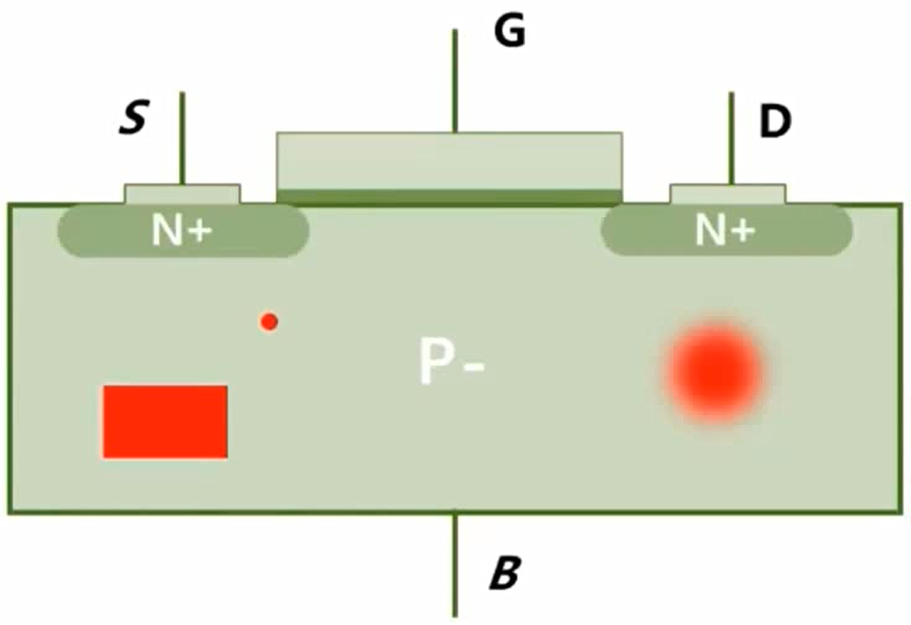

## 
缺陷与电荷

### 缺陷/缺陷分类
1. 类施主缺陷Donor/hNeutral：未被电子占据时显正电性，被电子占据时显电中性，主要俘获空穴，距离价带近；
2. 类受主缺陷Acceptor/eNeutral：未被电子占据时显电中性，被电子占据时显负电性，主要俘获电子，距离导带近。

### Physics选项
1. 材料：Material=“Silicon”；
2. 区域：Region=“Region_1”；
3. 材料界面：MaterialInterface=“Silicon/Oxide”；
4. 区域界面：RegionInterface=“Region_1/Region_2”。

### 缺陷查看
    Plot{
        * - Traps
        eTrappedCharge hTrappedCharge
        eGapStatesRecombination hGapStatesRecombination
    }

### 单点缺陷绘图
    File{
        ...
        trappedcarplotfile = "<string>"
        ...
    }
    ...
    TrappedCarDistrPlot{
        Material="Silicon"{
            (x_0 y_0 z_0)
            (x_1 y_1 z_1)
            ...
        }
    }

### 缺陷分布
#### 能量分布

#### 空间分布

### 缺陷语法
    Traps(
        * - Acceptor Exponential Tail of the Conduction Band;
        * - Energetic Profile, Level/Uniform/Gaussian/Exponential/Table;
        Acceptor Exponential Conc=<n> EnergySig=<sigma> EnergyMid=<n> FromCondBand
        * - Spatial Profile, Uniform/Gaussian;
        SpatialShape=Uniform SpaceMid= (x_0 y_0 z_0) SpaceSig=(dx dy dz)

        * - Acceptor Deep Levels;
        Acceptor Gaussian Conc=<n> EnergySig=<sigma> EnergyMid=<n> FromMidBandGap
        * - Scattering 
        hXsection=<n> eXsection=<n>

        * - Single Traps;
        * Energetic Profile, Level only;
        (Acceptor SingleTrap Level Conc=<n> EnergyMid=<n> FromMidBandGap
        * - Spatial Profile, Point;
        SpaceMid=(x_0 y_0 z_0)
        * - Randomize, if True, omitting the SpaceMid;
        Randomize
        )
    )

### 使用Tcl的if语法：
    #if [string match "string" "@string@"]
    ...
    #endif

### 固定电荷
    Traps(
        (FixedCharge 
            SpatialShape=[Gaussian | uniform]
            Conc=<float +->
            SpaceMid=<v>
            SpaceSig=<v>
        )
    )